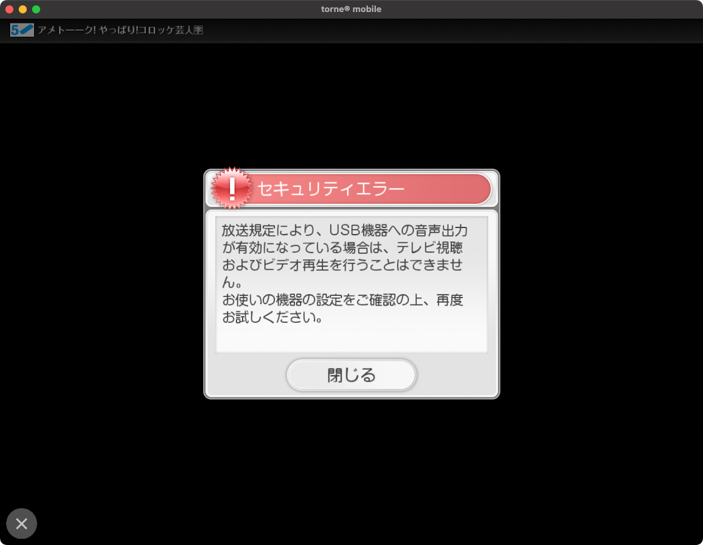
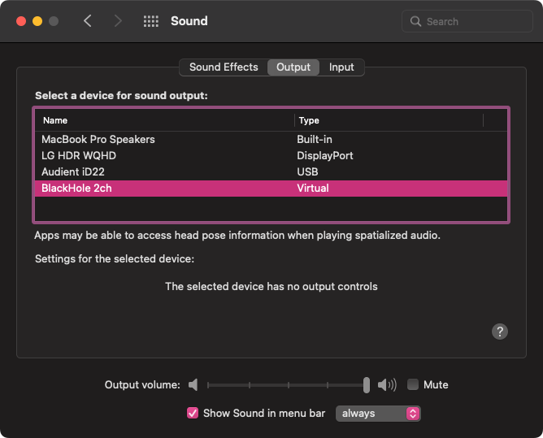
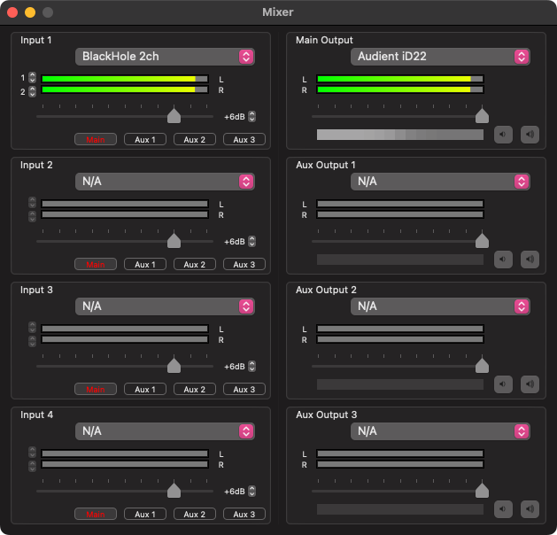

[昨年のベストバイのひとつは nasne だった。](https://hitsumabushi845.hatenablog.com/entry/2022/best-buy-2022)  
nasne は、PlayStation やスマートフォン、PC で torne アプリを使用して任意の場所からテレビや録画を視聴できるが、Mac 向けの nasne アプリは提供されていない。

しかし、Apple Silicon(M1以降) 搭載の Mac であれば iOS アプリを実行できるため、iOS 向けの torne mobile アプリを使用することで視聴が可能となる。

[https://apps.apple.com/jp/app/torne-mobile/id949323340:embed:cite]

というわけでアプリを入れて視聴できて良かったね、となるのだが、torne mobile の仕様として「USB 外部出力に音声を出力できない」というものがある。  

これはコンテンツの保護のためかと思うが、せっかく外部スピーカーを使用しているので、なんとかそこに音声を流す方法を模索した。

## Mac で nasne mobile の音声を外部スピーカーに出力する

必要なものは以下の2つ。配信とかやる人にはお馴染みのソフトウェア。

- BlackHole
[https://github.com/ExistentialAudio/BlackHole:embed:cite]  
OSSで提供される仮想オーディオドライバ。
- LadioCast  
[https://apps.apple.com/jp/app/ladiocast/id411213048?l=en&mt=12:embed:cite]  
音声ミキサーソフトウェア。

まず、Mac の音声出力を BlackHole に設定する。

その後、LadioCast で BlackHole の音声を外部出力に流すように設定する。

BlackHole は USB 機器として認識されないため、torne mobile の音声も LadioCast を通じて外部出力に流れる。

以上です。
